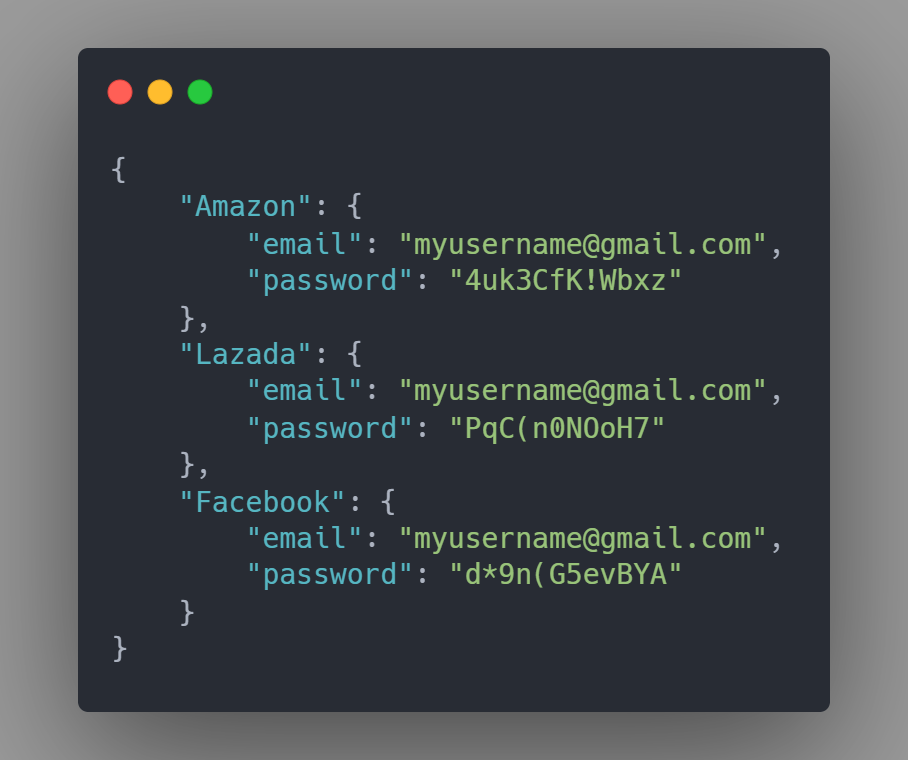

## PASSWORD VAULT

### Requirements
* tkinter
* random
* datetime
* pypclip

### Description
This application stores website, email/username and password into a local file called saved_entries.txt. User can choose to input preferred password or request the application to create one.

### Screenshots

